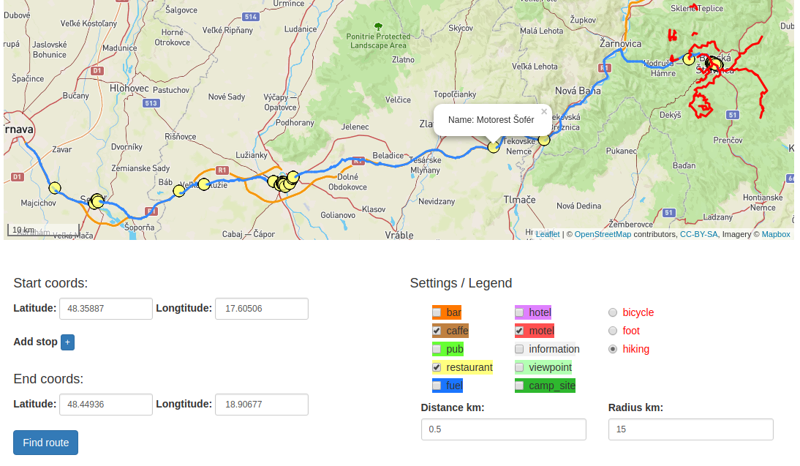

# Overview

This applications find route for you, nearby points of interest and touristic tracks . Most important features are:
- search for route using pgrouting.
- search for points of interest by proximity.
- search for touristic tracks around location.
- show results on map colored according to legend in application.

This is it in action:



The application has 2 separate parts, the client which is a [frontend web application](#frontend) using leaflet API and leaflet.js and the [backend application](#backend) written in [Django](https://www.djangoproject.com/), backed by PostGIS and pgRouting. The frontend application communicates with backend using a [REST API](#api).

# Frontend

The frontend application is a HTML page (`index.html`) generated by django, which shows a leaflet.js widget. I modified the style to better highlight all types of roads and used outdoors template. It displays road generated by pgrouting, nearby objects selected by user and touristic roads.

All relevant frontend code is in `route_planner/routeplanner/templates/routeplanner/index.html` which displays map and settings of route finder. The frontend code is simple, its only responsibilities are:
- display the map
- display geofeatures on map
- show user setting for route finding
- send ajax call to backend api with data

# Backend

The backend application is written in Django and is responsible for querying geo data, formatting the geojson data and sending data back to frontend.

## Data

 Geo data is coming directly from Open Street Maps. I downloaded an extent covering whole Slovakia and imported it using the `osm2pgsql` tool into the OSM schema in EPSG:4326 WGS 84 with hstore enabled. Pgrouting data were imported using osm2pgrouting.  To speedup the queries I created an index on geometry column (`way`) in all tables planet_osm_ tables and also in ways table on column (`the_geom`) for pgrouting because it was also used to find closest route to point. Indices were added with query simular to this :

`CREATE INDEX planet_osm_nodes_idx ON planet_osm_nodes USING GIST (the_geom);`

  All queries are in `route_planner/routeplanner/models.py` . GeoJSON is generated by using a standard `st_asgeojson` function, however some post-processing is necessary (in `route_planner/routeplanner/models.py`) in order to merge all data into a single geojson with properties like name or brand.

## Api

**Find hotels in proximity to coordinates**

```
POST /find_route

{"data":{"0":{"lat":"48.35887","lon":" 17.60506"},
         "1":{"lat":"48.44936","lon":" 18.90677"}},
         "options":{"amenity":["caffe","restaurant"],
                    "tourism":["motel"],
                    "route":"hiking",
                    "distance":"0.5",
                    "radius":"15"}}
```

Json request is dynamically generated according to settings in frontend.

### Response

API calls return json responses with top level key success in case of successful data retrieval or error with error with specific message. In case of success data are returned in geojson key under success.
```
{"success": {"geojson": [
      {"geometry": {"type": "LineString", "coordinates": [[17.6053999, 48.3581716], [17.6052197, 48.3583771], [17.6050173, 48.3586025]]}, "type": "Feature", "properties": {"name": "route"}},
      {"geometry": {"type": "LineString", "coordinates": [[17.6082752, 48.3556977],....
      .... ]}}
```

```
{"error": {"message": "Distance must be valid number."}}
```
`geojson` contains a geojson with locations of all linestrings (routes) and points (points of interest) and their properties like name or brand.
